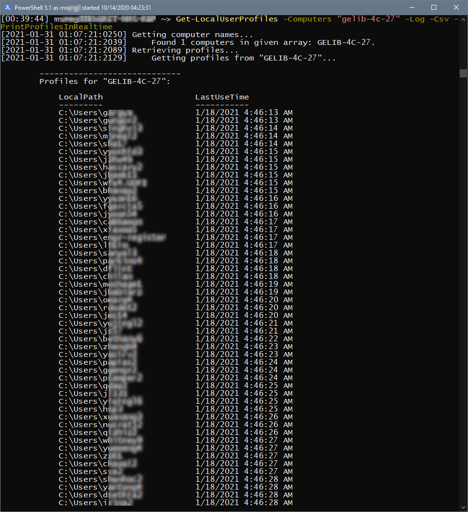

# Summary

This Powershell module pulls information about local user profiles from an array of given computers.  

It will dump some of this info about all profiles found on all given computers to the screen. Additionally it will optionally log data to a log file, and/or a CSV file, as well as return an object containing all the data.  

This is sort of a companion module to [Remove-LocalUserProfiles](https://github.com/engrit-illinois/Remove-LocalUserProfiles). Get-LocalUserProfiles is meant for gathering information and informing decisions about how to use Remove-LocalUserProfiles.

See below for more detailed [context](#context) and caveats. 

# Usage

1. Download `Get-LocalUserProfiles.psm1`
2. Import it as a module: `Import-Module "c:\path\to\Get-LocalUserProfiles.psm1"`
3. Run it using the parameters documented below
- e.g. `Get-LocalUserProfiles -Computers "gelib-4c-*" -Log -Csv -PrintProfilesInRealtime`

# Parameters

### -Computers <string[]>
Required string array.  
Array of computer names and/or computer name wildcard queries to poll.  
Computers must exist in AD, within the OU specified by `-OUDN`.  
e.g. `-Computers "gelib-4c-*","eh-406b1-01","mel-1001-*"`  

### -OUDN <string>
Optional string.  
The OU in which computers given by the value of `-Computers` must exist.  
Computers not found in this OU will be ignored.  
Default is `OU=Desktops,OU=Engineering,OU=Urbana,DC=ad,DC=uillinois,DC=edu`.  

### -Log
Optional switch.  
If specified, output will be logged to a file at the path specified by `-LogPath`.  

### -LogPath <string>
Optional string.  
The full path to the log file that will be created (if `-Log` was specified).  
Default is `c:\engrit\logs\Get-LocalUserProfiles_yyyy-MM-dd_HH-mm-ss.log`.  

### -Csv
Optional switch.  
If specified, results will be output to a CSV-formatted file at the path specified by `-CsvPath`.  

### -CsvPath <string>
Optional string.  
The full path to the CSV file that will be created (if `-Csv` was specified).  
Default is `c:\engrit\logs\Get-LocalUserProfiles_yyyy-MM-dd_HH-mm-ss.csv`.  

### -Verbosity <int>
Optional integer.  
The level of verbosity to include in output logged to the console and logfile.  
Currently not significantly implemented.  
Default is `0`.  

### -NoConsoleOutput
Optional switch.  
If specified, progress output is not logged to the console.  

### -MaxAsyncJobs <int>
Optional integer.  
The maximum number of asynchronous jobs allowed to be spawned.  
The script spawns a unique asynchronous process for each computer that it will poll, which significantly cuts down the runtime.  
Default is `10`, which is very conservative. This is to avoid the potential for network congestion and the possibility of the script being identified as malicious by antimalware processes and external network monitoring.  
To disable asynchronous jobs and external processes entirely, running everything sequentially in the same process, specify `0`. This will drastically increase runtime for large numbers of computers.  

### -IncludeSystemProfiles
Optional switch.  
By default, the script completely ignores any profiles which have a `LocalPath` property matching `*$env:SystemRoot*` (i.e. system account profiles).  
This is because the output of this module is primarily intended for use in conjuction with [Remove-LocalUserProfiles](https://github.com/engrit-illinois/Remove-LocalUserProfiles), and we don't want to encourage the accidental deletion of system profiles.  
If specified, system profiles are included in the gathered data and output.  

### -PrintProfilesInRealtime
Optional switch.  
If specified, each time a computer is polled, the list of targeted profiles found will be output to the console and log file.  
Useful for getting a feel for what the profiles look like while the script is still running.  
Not compatible with any value of `-MaxAsyncJobs` greater than `0`. Will be ignored in this case.  

### -Indent <string>
The string used as an indent, when indenting log entries.  
Default is `    ` (four space characters).  

### -CsvType <"ComputersSummary" | "ComputersSummaryExtended" | "FlatProfiles">
WIP

### -ReturnObject
WIP

### -ReturnObjectType
WIP

### -SortSummaryBy
WIP

### -CIMTimeoutSec
WIP

# Context

Specifically this module is mostly interested in the age of the profiles. For each computer, it looks through each profile and determines which profile is the "youngest" (i.e. has the most recent LastUseTime property), and which is the "oldest".  

In many circumstances this info would be useful for the purposes of using [Remove-LocalUserProfiles](https://github.com/engrit-illinois/Remove-LocalUserProfiles) to "delete profiles older than X days". However due to either Windows bugs, or incompatibilities with other tools, this LastUseTime property has proven to be completely unreliable as a source for determining when a user last logged in. This is likely due to the property being updated by some unknown mechanism. This is very frustrating for IT pros looking to rely on that information.  

This module was created mostly to scan large swaths of computers to look for patterns in the age of the youngest and oldest profiles. In the author's environment. Using it on any given shared computer, it's not uncommon to find that nearly all profiles have a LastUseTime within a few seconds of each other. This would be impossible if that property accurately described the times when these profiles were last legitimately used by their users. In our environment, this is the case even on computers which have over 600 profiles (from semesters of student logins).  

Sources on the issue:
- https://techcommunity.microsoft.com/t5/windows-10-deployment/issue-with-date-modified-for-ntuser-dat/m-p/102438
- https://community.spiceworks.com/topic/2263965-find-last-user-time
- https://powershell.org/forums/topic/incorrect-information-gets-recorded-in-win32_userprofile-lastusetime-obj/

# Notes
- By mseng3